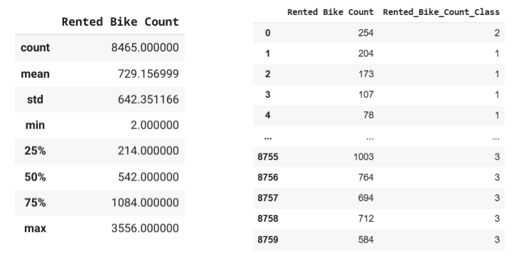
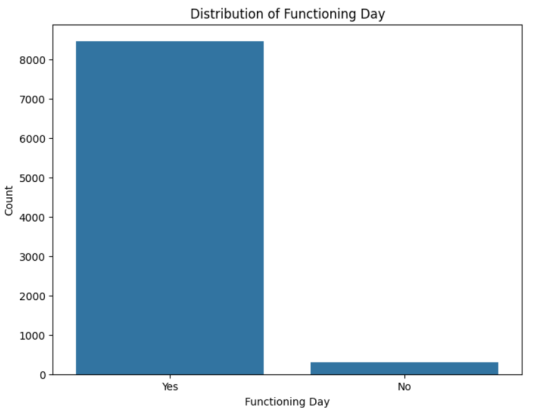
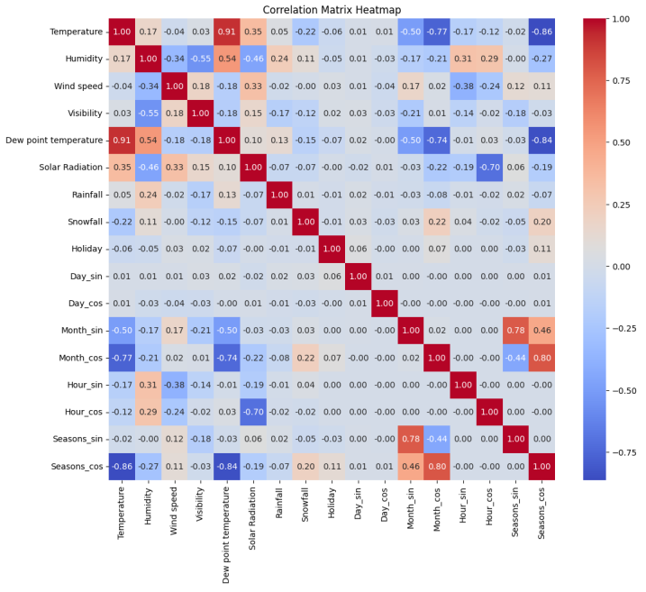

<<<<<<< HEAD
# seoul-bike-sharing-ml
Progetto di Machine Learning su dataset Seoul Bike Sharing
=======
# Seoul Bike Sharing Demand

**Autori:**  
Kristian Kovacev, matricola 885839  
Paolo Mascheroni, matricola 886220  

---

## Introduzione

E’ stato analizzato il dataset Seoul Bike Sharing Demand, disponibile sulla piattaforma UCI Machine Learning Repository. Contiene i dati raccolti da inizio dicembre 2017 a fine novembre 2018 in una compagnia di noleggio bici di Seoul. Ogni campione si riferisce ad un’ora e di conseguenza abbiamo 365 giorni per 24 ore, quindi 8760 istanze. In particolare, ogni istanza è descritta da 13 features e una colonna target, che indica un valore 0 se in quell’ora il servizio non era attivo oppure 1 se lo era.

Durante il nostro lavoro, abbiamo attuato una serie di modifiche sul dataset iniziale, tra cui la creazione di nuove feature, l’eliminazione di altre ed il cambiamento della variabile target. La nuova variabile target che abbiamo deciso di utilizzare è il numero di bici noleggiate per ogni ora.
Quindi, l'obiettivo finale del nostro progetto è stato sviluppare dei modelli che
approssimassero il numero di bici noleggiate ogni ora, scegliendo per ogni ora tra dei diversi intervalli di valori.
Per fare ciò abbiamo addestrato tre diversi modelli: SVM, reti neurali e alberi di decisione. Per ognuno di essi abbiamo praticato un'attenta selezione degli iperparametri tramite tecniche di validazione dei modelli.
Infine, abbiamo analizzato e paragonato i risultati dei tre modelli, commentando le principali differenze di prestazione.

Questi passaggi saranno illustrati e commentati nel dettaglio nelle prossime sezioni.

---

## Analisi esplorativa del dataset

Come anticipato, il dataset è composto da 8760 istanze, ognuna descritta da 13 features e da un valore target. Non esiste nessun valore null all’interno del dataset, come specificato sul sito web di UCI. 

### Features

| Nome Attributo        | Tipo        | Descrizione                         |
| --------------------- | ----------- | ----------------------------------- |
| Date                  | Date        | Data della rilevazione              |
| Hour                  | Integer     | Ora della giornata                  |
| Rented Bike Count     | Integer     | Numero di bici noleggiate           |
| Temperature           | Continuous  | Temperatura dell’aria (°C)          |
| Humidity              | Integer     | Umidità (%)                         |
| Wind Speed            | Continuous  | Velocità del vento (m/s)            |
| Visibility            | Integer     | Indice di visibilità ai 10 metri    |
| Dew point temperature | Continuous  | Punto di rugiada (°C)               |
| Solar Radiation       | Continuous  | Radiazione solare (Mj/m²)           |
| Rainfall              | Integer     | Pioggia (mm)                        |
| Snowfall              | Integer     | Neve (cm)                           |
| Seasons               | Categorical | Primavera, Estate, Autunno, Inverno |
| Holiday               | Binary      | Holiday/No Holiday                  |

**Valore target originale:**  

- `Functioning day = Yes` se il servizio era attivo  
- `Functioning day = No` altrimenti

Dopo un’analisi veloce della distribuzione della variabile target ci siamo resi conto del fatto che fosse estremamente sbilanciata.

In particolare, il numero di ore in cui il servizio non era funzionante non è nemmeno 1/20 del numero delle ore in cui invece il servizio funzionava.

Per questa ragione, abbiamo deciso di mantenere il dataset **ma di cambiare la variabile target**. Come variabile target alternativa, abbiamo scelto il **numero di bici noleggiate per ogni ora**, corrispondente alla colonna **Rented Bike Count** delle feature originali.

---

## Preprocessing

## Preprocessing sulla variabile target

1. Eliminati i campioni con `Functioning day = No` → dataset ridotto a **8465 istanze**.
2. Eliminata la colonna `Functioning day` e utilizzato `Rented Bike Count` come nuovo target.

1. Trasformato il target in **classi basate sui quartili**:

| Classe | Rented Bike Count |
| ------ | ----------------- |
| 1      | [0, 214)          |
| 2      | [214, 542)        |
| 3      | [542, 1084)       |
| 4      | [1084, 3556]      |

In questo modo, oltre a rendere più gestibile il problema, utilizzando i quartili abbiamo
ottenuto delle classi perfettamente bilanciate. Se andiamo a studiare la distribuzione di
**Rented_Bike_Count_Class**, infatti, troviamo:

### Nuove feature ed eliminazione della data

Nel lavoro di preprocessing del dataset, abbiamo dovuto convertire in valori numerici tutte quelle variabili di tipo categorico. In particolare, uno dei dati più complessi da trasformare era la **Data** di rilevazione. Per trasformarla abbiamo utilizzato due assunzioni, derivanti dalla nostra esperienza nel dominio del problema.
● esiste una notevole discrepanza tra il numero di biciclette che vengono noleggiate
nei differenti mesi, in particolare se paragoniamo mesi caldi con mesi freddi
● durante la settimana, si ha una forte variazione del numero di bici noleggiate con
picchi raggiunti durante i fine settimana.

Per queste due ragioni, abbiamo deciso di eliminare la feature Data, conservando solo il mese e introducendo la colonna **Month** (Integer in [1,12]) e considerando non interessanti né il numero del giorno del mese (vista la scarsa correlazione tra giorni che condividono lo stesso numero in questo dominio) né l'anno (i dati sono raccolti su un solo anno). Inoltre,abbiamo associato a ciascun giorno il giorno della settimana che rappresenta. Per fare questo abbiamo creato una nuova colonna **Day** (Integer in [1,7]). Siccome la prima data di rilevazioni, il 01/12/2017, era un venerdì, abbiamo assegnato il valore 5 nella colonna **Day** ai primi 24 campioni (24 campioni rappresentano 24 ore). Quindi abbiamo continuato assegnando il valore 6 ai successivi 24 campioni, e così via fino a riempire l’intera colonna.

- Eliminata feature `Date`  
- Aggiunta feature `Month` (1–12) e `Day` (1–7, giorno della settimana)  

### Encoding categorico e ciclico

In seguito, siamo passati all’encoding delle feature, codificandole in questo modo:

- Holiday: 0 = No Holiday, 1 = Holiday  
- Day, Month, Hour, Seasons → **Encoding ciclico**:  Utilizziamo un encoding ciclico sostituendo ognuna delle feature sopracitate con due nuove feature, una componente seno e una coseno, secondo la formula:

\[
x_{\sin} = \sin\left(\frac{2\pi x}{P}\right), \quad x_{\cos} = \cos\left(\frac{2\pi x}{P}\right)
\]

Dove P è il periodo di oscillazione (24 per le ore, 12 per i mesi, 7 per i giorni della
settimana, 4 per le stagioni).

Abbiamo scelto questo tipo di encoding in modo tale che l’ordine artificiale che
avevamo introdotto tra i mesi non inficiasse negativamente sulla classificazione dei
modelli. Infatti, senza applicare questa tecnica il modello interpreterebbe la distanza
tra due mesi consecutivi come Dicembre e Gennaio come una distanza massima
(essendo Dicembre 12 e Gennaio 1), cosa che non riflette la realtà.
Grazie a questa tecnica, tutti i modelli basati su distanze metriche possono
comprendere la ciclicità delle variabili.
Infine, non essendo molte le feature iniziali ed essendo solo 4 le feature da codificare
ciclicamente, possiamo permetterci questo aumento nel numero di features.
Dopo questo passaggio passiamo da 13 features a 17.

### Scaling e feature reduction

Il passaggio successivo è stato scalare i dati utilizzando la funzione StandardScaler di
scikit-learn, una tecnica di standardizzazione che trasforma le feature in modo che abbiano media 0 e deviazione standard 1. Tutte le feature sono state scalate, tranne la feature binaria Holiday. In seguito, abbiamo analizzato la matrice di correlazione per verificare il grado di dipendenza tra le diverse variabili.

Da essa, è emersa una forte correlazione tra le variabili **Temperature, Dew point**
**temperature, Seasons_sin, Seasons_cos, Month_cos, Month_sin.**

Ciò è facilmente spiegabile in quanto:
● la temperatura del punto di rugiada (**Dew point temperature**) varia in base alla
temperatura (**Temperature**)
● la temperatura varia molto in relazione a stagioni e mesi
● le stagioni sono correlate ai mesi, infatti mesi vicini sono spesso appartenenti
stessa stagione

Dopo questa analisi, abbiamo deciso di eliminare le features **Temperature, Seasons_sin,Seasons_cos**, in modo tale da ridurre la ridondanza del dataset (eliminate tutte le correlazioni > 0.75) e rendere il dataset più semplice da classificare.

Dopo il preprocessing effettuato sul dataset iniziale, abbiamo ottenuto un cambiamento. Di seguito visualizziamo la struttura del dataset finale utilizzata per l’addestramento di tutti i modelli.

### Dataset finale

| Nome Attributo          | Tipo       | Descrizione                       |
| ----------------------- | ---------- | --------------------------------- |
| Humidity                | Continuous | Umidità (%)                       |
| Wind Speed              | Continuous | Velocità del vento (m/s)          |
| Visibility              | Continuous | Indice di visibilità ai 10 metri  |
| Dew point temperature   | Continuous | Punto di rugiada (°C)             |
| Solar Radiation         | Continuous | Radiazione solare (Mj/m²)         |
| Rainfall                | Continuous | Pioggia (mm)                      |
| Snowfall                | Continuous | Neve (cm)                         |
| Holiday                 | Binary     | 0/1                               |
| Day_sin                 | Continuous | Seno del giorno della settimana   |
| Day_cos                 | Continuous | Coseno del giorno della settimana |
| Hour_sin                | Continuous | Seno dell'ora                     |
| Hour_cos                | Continuous | Coseno dell'ora                   |
| Month_sin               | Continuous | Seno del mese                     |
| Month_cos               | Continuous | Coseno del mese                   |
| Rented_Bike_Count_Class | Integer    | Target 1–4                        |

---

## Modelli

Nel seguente lavoro sono state scelte e applicate diversi modelli di classificazione per
ipotizzare il numero di bici noleggiate in una determinata ora. Dato che dopo il preprocessing gli attributi sono di tipo continuo o binario e abbiamo un dataset etichettato, abbiamo scelto di utilizzare i seguenti modelli supervisionati:
● Support Vector Machine
● Multi-layer Perceptron

### Support Vector Machine (SVM)

Le Support Vector Machine (SVM) sono algoritmi di apprendimento supervisionato utilizzati per la classificazione. La suddivisione dei dati avviene trovando l’iperpiano migliore.
Nel nostro caso, abbiamo deciso di utilizzarle in quanto permettono un’apprendimento
buono con un tempo di addestramento relativamente basso. Inoltre essendo, modelli
supervisionati si adattano perfettamente ad un problema di riconoscimento multiclasse come la nostra.

In questo processo abbiamo suddiviso i dati in tre sottoinsiemi: **training set (60%)** utilizzato per addestrare il modello, **validazione (20%)** utilizzato per la selezione degli iperparametri ottimi e **test (20%)** per valutare le prestazioni finali del modello. Dopo la suddivisione iniziale, i dati di training e validazione sono stati concatenati per poterli utilizzare nella fase successiva di **k-fold cross validation**.

Essendo la k-fold cross validation molto onerosa in termini computazionali in quanto richiede di effettuare k iterazioni per ogni combinazioni di iperparametri, la prima ricerca generale l’abbiamo svolta utilizzando solo i risultati sul validation set come parametro.
Inizialmente abbiamo cercato il kernel più adatto, ovvero la funzione utilizzata per
trasformare i dati in uno spazio superiore, attraverso la GridSearchCV, valutando tre diverse opzioni: Linear, RBF, Poly. Il miglior kernel selezionato in base alla validazione è stato RBF.

Una volta scelto il **kernel RBF**, per trovare gli iperparametri migliori del modello abbiamo effettuato una ricerca per selezionare i migliori valori per C e Gamma, sui seguenti valori:
● C: 10, 25, 50, 75, 100, 120
● Gamma: 0.2, 0.1, 0.05, 0.01, 0.005, 0.001
Ottenendo come valori ottimali: **C = 100 e gamma = 0.05**.

Con questi risultati abbiamo poi applicato la GridSearchCV combinata con StratifiedKFold con un numero di fold pari a 5 su training set + validation set, andando ad analizzare valori nell’intorno di C = 100 e Gamma = 0.05. Ciò è stato fatto per cercare di selezionare degli iperparametri che si adattassero il più possibile al dataset, e non rischiare di prendere solo quelli che per ‘casualità’ meglio si adattavano al validation set. La grid è stata inizializzata con i seguenti valori:
● C: 95, 100, 105
● Gamma: 0.03, 0.05, 0.08

Da qui abbiamo ottenuto **C = 105** e **gamma = 0.05** come migliore combinazione.

In generale, questo approccio ci ha permesso di valutare ogni combinazione di
iperparametri. Nella fase iniziale, sono stati identificati i valori di iperparametri più
promettenti in modo rapido e con poco costo computazionale, ovvero Kernel = RBF, C = 100 e Gamma = 0.05. Successivamente, quando avevamo un’idea di quali fossero i valori migliori, attraverso una validazione incrociata più approfondita con StratifiedKFold, è stato selezionato il modello definitivo con C = 105 e Gamma = 0.05, basandosi sull'accuratezza media ottenuta sui diversi fold.

### Reti Neurali 

Le reti neurali sono classificatori molto potenti, che si avvalgono di una grandissima quantità di parametri per apprendere i pattern presenti nei dataset. Vengono addestrate su un insieme di dati sfruttando la BackPropagation, uno speciale algoritmo che consente di propagare l’errore sulla funzione obiettivo su tutti i livelli della rete, consentendo di ottimizzare il modello aggiustando i parametri di ogni neurone.
Abbiamo deciso di utilizzarle perchè hanno un’ottima precisione e una grande capacità di approssimazione. Inoltre, il nostro dataset è bilanciato e numerico, il chè permette di
applicarle senza il minimo problema. Infine, il numero molto alto di parametri e iperparametri presenti nelle rete neurali permettono di sperimentare molto con il modello.

Per utilizzarle all’interno del nostro problema di classificazione abbiamo dovuto prima di tutto “vettorizzare” la variabile target, il che è la normale prassi quando si tratta un problema di classificazione multiclasse con una rete neurale.
Dopodichè, abbiamo creato il modello utilizzando le funzioni della libreria **Keras**.

Abbiamo deciso di utilizzare la tecnica dell’ **Early stopping** su ciascun modello, per evitare l’overfitting. Infatti, utilizzando il validation set definito in precedenza, abbiamo impostato una “pazienza” massima di 15 epoche sul valore della funzione loss sul validation set. In questo modo, se il numero di epoche inserito è eccessivo il modello invece di adattarsi troppo ai dati di training, andando in overfitting, ferma l’esecuzione e recupera i parametri dall’epoca in cui aveva salvato minor valore della funzione loss sul validation set.

Per migliorare la generalizzazione del modello e ridurre l’overfitting abbiamo deciso di
utilizzare un **dropout** su ciascun layer della rete. Utilizzando questa tecnica, ad ogni epoca una percentuale casuale di neuroni viene spenta. In questo modo, i neuroni devono imparare a classificare correttamente le istanze senza poter far affidamento sugli altri il chè aumenta la capacità del modello di generalizzare. Inoltre, la capacità del modello di imparare “a memoria” i dati di training viene ridotta, riducendo quindi la possibilità di overfitting.

#### Ottimizzazione degli iperparametri

In questo caso, a differenza di ciò che è stato fatto con SVM, non è stato possibile utilizzare una Search Grid e/o la k-fold cross validation per valutare i migliori parametri.
Infatti, il tempo impiegato da ciascun addestramento unito alla quantità di combinazioni di iperparametri possibile avrebbe portato a dei tempi computazionali inaccettabili.

Per questo sono stati provati diversi iperparametri e diverse architetture, cercando di
estrarne una valutazione abbastanza approssimata sulla bontà di essi. Inoltre, ogni
combinazione è stata provata tre volte e la media dell’accuratezza sulle tre esecuzioni è stata utilizzata per fare confronti.
Sicuramente, non possiamo dire che la media di tre esecuzioni sia un valore che abbia un significato a livello statistico, ma anche in questo caso il numero è stato scelto per rendere il costo computazionale accettabile.
Per questo motivo, non è assolutamente detto che un modello che noi presentiamo come il migliore sia effettivamente quello che classifica meglio.
Dopo queste doverose premesse, i risultati ottenuti sono mostrati di seguito:
● il learning rate è stato scelto uguale a 0.001 per tutti i modelli. Questa è l’unica
assunzione e ci permette di ridurre di almeno due volte il numero di modelli da
testare
● il numero di layer influenza come ci si aspetterebbe la capacità del modello, tuttavia
già con solo 1 layer nascosto con 64 neuroni si ottiene un’ottima accuratezza, la
quale non cresce enormemente in seguito

Esempio di Accuracy in un’ esecuzione con funzione Relu, dropout 0.2, learning rate
0.001, batch_size 32

| Architettura            | Accuracy |
| ----------------------- | -------- |
| 1 layer (64)            | 0.8266   |
| 2 layer (64,64)         | 0.8379   |
| 3 layer (64,128,64)     | 0.8396   |
| 4 layer (64,128,128,64) | 0.8485   |

● la funzione Relu sembra comportarsi meglio della LeakyReLu come funzione di
attivazione

Esempio di Accuracy media ottenuta sul set di test dopo tre addestramenti con
dropout 0.2, learning rate 0.001, batch_size 32

|                | **2 layer (64, 64)** | **3 layer (64, 128, 64)** |
| -------------- | -------------------- | ------------------------- |
| **Leaky ReLu** | 0,8328               | 0,8376                    |
| **ReLu**       | 0,8379               | 0,8426                    |

● un batch size = 64 sembra migliore di 32

Esempio di Accuracy media ottenuta sul set di test dopo tre addestramenti con ReLu,
dropout 0.2, learning rate 0.001

|                    | 1 layer (64) | **3 layer (64,128,64)** |
| ------------------ | ------------ | ----------------------- |
| **bach size = 32** | 0.8243       | 0.8396                  |
| **bach size = 64** | 0.8272       | 0.8426                  |

● sul valore di dropout (percentuale) non abbiamo evidenza se sia migliore 0.1 oppure
0.2

**Modelli finali testati:**

| Modello | Layer   | Dropout | Accuracy media | Precision | Recall | F1-score |
| ------- | ------- | ------- | -------------- | --------- | ------ | -------- |
| A       | 2 layer | 0.1     | 0.8359         | 0.8359    | 0.8362 | 0.8357   |
| B       | 3 layer | 0.2     | 0.8462         | 0.8467    | 0.8467 | 0.8460   |
| C       | 4 layer | 0.2     | 0.8474         | 0.8470    | 0.8475 | 0.8468   |

In base a questi valori, scegliamo il **Modello B** in quanto ha dei risultati leggermente
peggiori del **Modello C** ma è più semplice, avendo 3 layer (un layer in meno).
Va detto che ci sono altri iperparametri che abbiamo fissato all’inizio e che avrebbero potuto rendere migliore il modello, come per esempio il numero massimo di iterazioni fissato a 200 oppure la “pazienza” dell’earling stop di “15” epoche.

---

## Risultati

L’obiettivo del problema inizialmente era effettuare una classificazione corretta che, a partire da un dataset contenente diverse rilevazioni svolte durante ogni ora per un intero anno riuscisse a predire correttamente quante bici erano state noleggiate in quell’ora, o meglio, in quale range cadesse tale valore.

Dopo aver addestrato i modelli, prestando particolare attenzioni a ottimizzarne gli
iperparametri, questi sono i risultati che abbiamo ottenuto sul set di test (20 % dei campioni totali)

### SVM

- Kernel: RBF, C=105, gamma=0.05  
- Accuracy: 0.8240  
- Precision media: 0.82  
- Recall media: 0.82  
- F1-score medio: 0.82  

| Classe | Precision | Recall | F1-Score |
| ------ | --------- | ------ | -------- |
| 1      | 0.88      | 0.84   | 0.86     |
| 2      | 0.75      | 0.82   | 0.78     |
| 3      | 0.81      | 0.77   | 0.79     |
| 4      | 0.86      | 0.87   | 0.87     |

### Reti Neurali

- 3 layers nascosti (64,128,64), dropout 20%, batch_size=64, learning rate=0.001  
- Accuracy media: 0.8406  
- Precision media: 0.8400  
- Recall media: 0.8406  
- F1-score medio: 0.8400  

| Classe | Precision | Recall | F1-Score |
| ------ | --------- | ------ | -------- |
| 1      | 0.8906    | 0.8805 | 0.8853   |
| 2      | 0.7855    | 0.7926 | 0.7889   |
| 3      | 0.8145    | 0.7876 | 0.8008   |
| 4      | 0.8695    | 0.9017 | 0.8851   |

---

## Commenti sui risultati e conclusioni

| Modello      | Accuracy | Precision | Recall | F1-score |
| ------------ | -------- | --------- | ------ | -------- |
| SVM          | 0.8240   | 0.82      | 0.82   | 0.82     |
| Reti Neurali | 0.8406   | 0.8400    | 0.8406 | 0.8400   |

- Le reti neurali performano meglio della SVM su tutte le metriche.
- Entrambi i modelli hanno difficoltà maggiori sulle classi 2 e 3, probabilmente perché si trovano tra altre due classi.
- Reti neurali richiedono più risorse computazionali e tempo di addestramento rispetto alla SVM.
- La scelta del modello dipende dalla precisione desiderata e dalle risorse computazionali disponibili.
>>>>>>> a709ea0 (Caricamento progetto ML)
